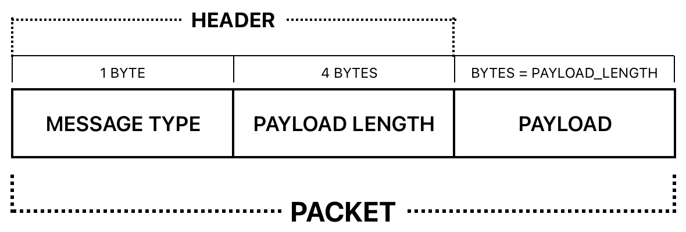
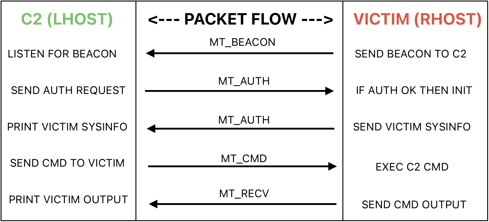

# RATTENPRINZ 
RATTENPRINZ (Rat Prince) is a paired revshell with C2/listener written in Python. Designed to be lightweight, it can be used out-of-the-box on any system with Python 3 installed.

**To explore capabilities, run:** `python3 c2.py --help`

The shell is relatively stable, with auto-reconnect if the user CTRL+C's out - this somewhat mitigates common issues with shells hanging or randomly disconnecting. Auto-reconnect is enabled by the revshell.py beaconing out every few seconds with a jitter applied to randomize beacon timing. 

File upload (C2/listener -> revshell) and file download (revshell -> C2/listener) is supported through the *'UPLOAD'* and *'DOWNLOAD'* commands. RATTENPRIZN shell history can be accessed by typing *'LHISTORY'*. 

*Communication* between the LHOST (C2/listener) and the RHOST (revshell) uses a custom binary protocol - a simple [TLV](https://en.wikipedia.org/wiki/Type–length–value) (Type-Length-Value) encoding scheme, with a header of 5 bytes: 1 byte for the **MESSAGE TYPE** and 4 bytes for the **PAYLOAD LENGTH**, followed by the full **PAYLOAD**, which is encoded using an *XOR CIPHER*. 


*Packet flow* begins with the revshell connecting back to a listening socket on the C2/listener and beaconing, followed by rudimentary authentication enabled by message types which then enables commands to be sent from the C2/listener through to the revshell to be executed on the RHOST, with output sent back to the C2/listener and displayed to the LHOST. 


### MESSAGE TYPES:
```
MT_BEACON 	= 0
MT_AUTH 	= 1
MT_CMD		= 2
MT_RECV		= 3
MT_UP		= 4
MT_DWN		= 5
MT_DATA		= 6
MT_ERR		= 7
```

**NB.** The following *GLOBAL VARIABLES* should be edited if one wishes to use the scripts:
```
C2_IP (revshell.py)
C2_PORT (revshell.py)
LHOST (c2.py)
```
One may also edit the `XOR_KEY` (found in both scripts), though since XOR is more obfuscation than 'encryption', it won't have any meaningful effect. 

### MISC
WRT encryption - an effort was made to use [Elliptic Curve Diffie-Hellman Key Exchange](https://cryptobook.nakov.com/asymmetric-key-ciphers/ecdh-key-exchange) and a barely-viable working version was layered on top of comms, but it required the [cryptography module](https://cryptography.io/en/latest/hazmat/primitives/asymmetric/ec/), at least on the client side (LHOST C2/listener), which made this project overly complex and no longer 'lightweight'. In any case, initializing the keys took far too long computationally, which felt like bloat and a reduced user experience. Thus simple XOR was chosen to provide some bare minimum obfuscation.  

## Ethical Use Policy

This project is provided **for educational and research purposes only**.

Unauthorized use against systems you do not own or have explicit permission to access is illegal and strictly prohibited.

Users are solely responsible for ensuring compliance with all applicable laws and regulations. The author assumes no liability for any misuse.
